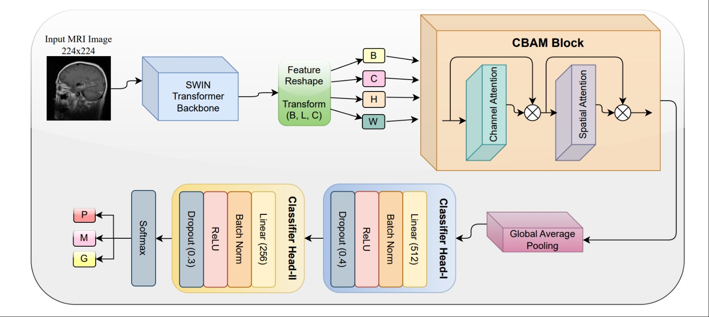
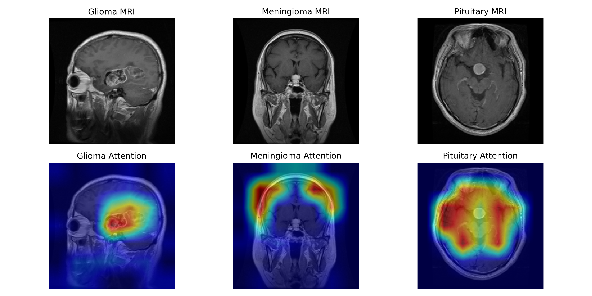

# Robust Brain Tumor Classification using Attention-Enhanced Swin Transformers

[](https://opensource.org/licenses/MIT)
[](https://pytorch.org/)
[](https://github.com/Latchan-Ch/Robust-Swin-Brain-Tumor)

> **Official implementation** of the paper: *"Robustness of Attention-Enhanced Swin Transformers Against Data Leakage in Brain Tumor Classification"*.

## Overview
State-of-the-art brain tumor classification models often suffer from **Data Leakage** due to random splitting, leading to inflated accuracies (99%+) that collapse on unseen patients. 

We propose a **Patient-Level Split** benchmark and a novel **Attention-Enhanced Swin Transformer** that integrates **CBAM** to strictly learn pathological features, achieving **96.82% accuracy** on the rigorous "Hard Mode" split.

<p align="center">
  
</p>

---

## Dataset Link : [Brain Tumor Dataset on Figshare](https://figshare.com/articles/dataset/brain_tumor_dataset/1512427)

---

## Key Features
- **Strict Patient-Level Split:** Zero overlap of patients between Train/Test sets.
- **Attention Mechanism:** Integrated CBAM (Channel + Spatial Attention) into Swin-Tiny.
- **SOTA Performance:** Outperforms EfficientNet-B0 and ViT-Small on unseen patients.
- **Explainability:** Grad-CAM visualizations confirming artifact-free learning.

---

## Results (Patient-Level Split)

| Model | Parameters | Accuracy (Unseen Patients) | Robustness Gap |
| :--- | :---: | :---: | :---: |
| ResNet-50 | 25.6M | 95.97% | 2.29% |
| EfficientNet-B0 | 5.3M | 91.95% | 3.71% |
| ViT-Small | 22.0M | 94.28% | 3.12% |
| Swin-Tiny | 28.3M | 96.19% | 1.64% |
| **Att-Swin (Ours)** | **28.3M** | **96.82%** | **1.23%** |

---

## Qualitative Analysis
Our model ignores background noise (skull, eyes) and focuses strictly on the tumor mass, as confirmed by Grad-CAM.

<p align="center">
  
</p>

---

## Citations: 
If you use this code, please cite our paper:

@inproceedings{chhetri2026robust,
  title={Robustness of Attention-Enhanced Swin Transformers Against Data Leakage in Brain Tumor Classification},
  author={Chhetri, Latchan and Ghosal, Palash},
  booktitle={IEEE Conference Name (GCON)},
  year={2026}
}

## Contacts:

For questions, please contact Latchan Chhetri.

## Installation

```bash
git clone [https://github.com/Latchan-Ch/Robust-Swin-Brain-Tumor.git](https://github.com/Latchan-Ch/Robust-Swin-Brain-Tumor.git)
cd Robust-Swin-Brain-Tumor
pip install -r requirements.txt
